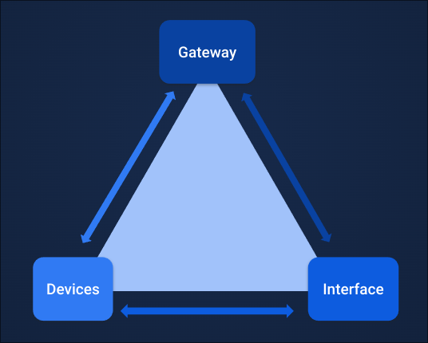

# IoT Architecture
The architecture of the Internet of Things (IoT) is designed to enable seamless interaction between the physical and digital worlds. At its core, it comprises three key components: devices, gateways, and interfaces. These elements collaborate to facilitate data acquisition, communication, processing, and user interaction, forming a structured framework for IoT applications.

## Key Components of IoT Architecture

### Devices
Devices form the foundational layer of the IoT ecosystem, consisting primarily of sensors and actuators. Sensors capture data from the environment, such as temperature, humidity, motion, or light, while actuators perform actions in response to specific commands, such as turning on a motor or adjusting a thermostat. These devices are typically embedded with microcontrollers (e.g., ESP32, STM32) or system-on-chip (SoC) modules, enabling them to perform local computations and transmit data over communication networks. IoT devices can operate using diverse communication protocols, such as Wi-Fi, Bluetooth, Zigbee, or LoRa, depending on the application requirements.

### Gateways
Gateways act as intermediaries between IoT devices and backend systems or cloud platforms. Their primary function is to enable data aggregation, protocol translation, and secure communication. Gateways collect data from multiple devices, convert it into standard internet protocols like MQTT, CoAP, or HTTP, and transmit it to higher-level processing systems.

Additionally, gateways often incorporate edge computing capabilities, allowing them to preprocess data locally. This reduces latency, minimizes bandwidth usage, and enhances system responsiveness, particularly in time-sensitive applications like industrial automation or autonomous vehicles. 

Gateways also ensure secure communication by encrypting data and authenticating devices, thereby protecting IoT networks from potential cyber threats.

### Interfaces
Interfaces are the user-facing components of IoT architecture that enable interaction, monitoring, and control of devices and systems. These include mobile applications, web dashboards, and application programming interfaces (APIs). Interfaces present processed data in a visual and interactive format, allowing users to make informed decisions and control IoT devices effectively.

## Integration of Components
In an IoT system, these three components work together cohesively:

1. Devices collect raw data from the environment.
2. Gateways transmit the data to backend systems after preprocessing and protocol conversion.
3. Interfaces allow users to monitor the data, analyze trends, and send commands to devices.

This architecture ensures scalability, security, and flexibility across IoT applications, enabling the development of smart systems in domains such as healthcare, agriculture, manufacturing, and smart cities. It is the synergy of devices, gateways, and interfaces that makes IoT systems robust and user-friendly, meeting both technical and practical requirements.
